# Archethic Network Push notification server
## Deployment
### Development

```sh
docker-compose up --build --scale push_server=3
```

> This command will use `docker-compose.yaml` AND `docker-compose.override.yaml`

> Replace `3` by the the number of `push_server` instances you want


### Production

#### Install systemd service

```sh
cp archethic-messaging-notification.service /etc/systemd/system
systemctl daemon-reload
```

#### Using service

```sh
systemctl start archethic-messaging-notification
systemctl stop archethic-messaging-notification

journalctl -u archethic-messaging-notification -f
```

## Use cases
### Notification publication

```mermaid
sequenceDiagram
    autonumber
    
    participant Mobile as 📱 ArchethicWallet
    participant Node as Nodes
    participant Redis as Redis
    participant Firebase as Firebase Cloud Messaging

    Mobile->>Node: Notification send request
    Node->>Node: Request validation
    Node->>Redis: Websocket notification
    Node-->>Redis: Read push tokens
    Node->>Firebase: Push notif
```

<details>


</details>


### Push notification subscription

```mermaid
sequenceDiagram
    autonumber

    participant Mobile as 📱 ArchethicWallet
    participant Node as Nodes
    participant Redis as Redis
    participant Firebase as Firebase Cloud Messaging

    Mobile->>Firebase: Get Push notif token
    Mobile->>Node: Save prefered language
    Node->>Redis: Save settings for Push token
    Mobile->>Node: Subscribe Push notifications for a TxChain
    Node->>Redis: Add push token to TxChain listeners

    Note over Mobile,Firebase: A TxSent event is received

    Firebase->>Mobile: Push notification

```

<details>


</details>


### Websocket notifications subscription

```mermaid
sequenceDiagram
    autonumber

    participant Mobile as 📱 ArchethicWallet
    participant Node as Nodes
    participant Redis as Redis
    participant Firebase as Firebase Cloud Messaging

    Mobile->>Node: Subscribe to TxSent events on a TxChain
    Node->>Redis: Add mobile to TxChain room

    Note over Mobile,Firebase: A TxSent event is received

    Redis-->>Node: TxSent event
    Node->>Mobile: TxSent event
```

<details>


</details>


## HTTP APIs


### Sending notification

When your application has created a new transaction, it can send a notification to all listeners (websocket and PUSH).

The notification must be sent 20 seconds maximum after the transaction creation.


<details>
<summary>Request</summary>

```POST /transactionSent```

```typescript
{
    // Genesis addresses of the updated transaction chains
    txChainGenesisAddress: string
    // Addresses of the new transaction
    txAddress: string
    // PUSH notification payload. Indexed by language.
    pushNotification: Map<string, PushNotification>
    // Signature of the concatenation of `txAddress` and 
    // `txChainGenesisAddress`. 
    // Signature is made with the private key used 
    // to sign the previous transaction.
    payloadSignature: string
}
```


```typescript
PushNotification = {
    title: string
    body: string
}
```

#### Example

```json
{
    "txChainGenesisAddress": "0000f5024b5290588d56e9b5600d517a7f9595af3a65f2e742e3757196f57fb4ad17",
    "txAddress": "0000b0e59c13138a7a3ad64e73857b600043bd71a5dc90420c14e28c57722185c282",
    "payloadSignature": "...",
    "pushNotification": {
        "en": {
            "title": "New message",
            "body": "Bob sent you a message."
        },
        "fr": {
            "title": "Nouveau message",
            "body": "Bob vous a envoyé un message."
        }
    }
}

```
</details>


<details>
<summary>Error Responses</summary>

```json
{
    "error": "A reason"
}
```

</details>


### Subscribing PUSH notifications

Call this to receive PUSH notifications when a new transaction arrives on any of the specified transaction chains.

You should call this method when your `push token` changes too.

<details>
<summary>Request</summary>

```POST /subscribePush```

Body:
```typescript
{
    // Your application's installation FCM token
    pushToken: string,
    // Genesis addresses of the transaction chains to listen
    txChainGenesisAddresses: Array<string>
}
```
</details>


<details>
<summary>Error Responses</summary>


```json
{
    "error": "A reason"
}
```
</details>

### Unsubscribing PUSH notifications

Call this to stop receiving PUSH notifications when new transaction arrives on any of the specified transaction chains.

<details>
<summary>Request</summary>

```POST /unsubscribePush```

Body
```typescript
{
    // Your application's installation FCM token
    pushToken: string,
    // Genesis addresses of the transaction chains to listen
    txChainGenesisAddresses: Array<string>
}
```
</details>


<details>
<summary>Error Responses</summary>

```json
{
    "error": "A reason"
}
```

</details>


### Update PUSH settings

Call this to setup the PUSH notifications you wish to receive. For now, you can only change the expected language.

<details>
<summary>Request</summary>

```PUT /pushSettings```

Body
```typescript
{
    // Your FCM token
    pushToken: string,
    // The expected locale
    locale: string,
}
```
</details>


<details>
<summary>Error Responses</summary>

```json
{
    "error": "A reason"
}
```
</details>

## SocketIO APIs

A socket.io server is used for Websocket notifications. 

### SocketIO entrypoint

```
/socket.io
```

### Receiving Notifications

To receive notifications, you need to listen to `TxSent` events.

You must [subscribe to specific transaction chains updates](#subscribing_notifications) too.


<details>
<summary>Notifications body :</summary>

```typescript
{
    // Genesis addresses of the updated transaction chains
    txChainGenesisAddress: string
    // Addresses of the new transaction
    txAddress: string
    // PUSH notification payload. Indexed by language.
    pushNotification: Map<string, PushNotification>
    // Signature of the concatenation of `txAddress` and 
    // `txChainGenesisAddress`. 
    // Signature is made with the private key used 
    // to sign the previous transaction.
    payloadSignature: string
}
```

```typescript
PushNotification = {
    title: string
    body: string
}
```
</details>

### Subscribing Notifications

Call this to receive `TxSent` events when a new transaction arrives on any of the given transaction chains.

<details>
<summary>Message</summary>

Name
```subscribe```

Body:
```typescript
{
    // Genesis addresses of the transaction chains to listen
    txChainGenesisAddresses: Array<string>
}
```
</details>

### Unsubscribing Notifications

Call this to stop receiving `TxSent` events when a new transaction arrives on any of the given transaction chains.

<details>
<summary>Message</summary>

Name
```unsubscribe```

Body:
```typescript
{
    // Genesis addresses of the transaction chains to listen
    txChainGenesisAddresses: Array<string>
}
```
</details>
